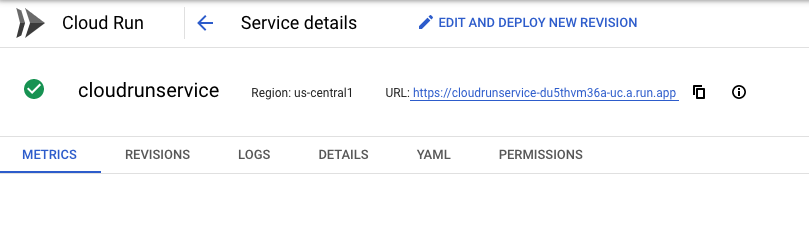

# Creating CI/CD pipeline using Cloud Build for Java App

The CI/CD pipelines can be build using different tech stacks like Google Cloud Build, Jenkins, TeamCity, GitLab, etc. Here I am using Google Cloud Build to create the CI/CD pipeline to build and deploy a Java Microserice to Cloud Run. This pipeline will use a Java Application from Cloud Source Repository to trigger the build. Here are the steps.

1. File push to the Cloud Repository will trigger the build

2. Create cloudbuild.yaml (Use Maven to produce the Jar file artifact)

3. Build Docker image (Push the Jar file as Docker image to Container Registery)

4. Wire the Source Repository Project to Cloud Build

5. Deploy The Docker image to Cloud Run

Before we start building the pipeline, we need to set the IAM permissions(https://cloud.google.com/cloud-build/docs/quickstart-deploy).

## Grant permissions

Cloud Build requires Cloud Run Admin and IAM Service Account User permissions before it can deploy an image to Cloud Run.

Open a terminal window.

Set environment variables to store your project ID and project number:

```
PROJECT_ID=$(gcloud config list --format='value(core.project)')
PROJECT_NUMBER=$(gcloud projects describe $PROJECT_ID --format='value(projectNumber)')
```

Grant the Cloud Run Admin role to the Cloud Build service account:

```
gcloud projects add-iam-policy-binding $PROJECT_ID \
    --member=serviceAccount:$PROJECT_NUMBER@cloudbuild.gserviceaccount.com \
    --role=roles/run.admin
```

Grant the IAM Service Account User role to the Cloud Build service account for the Cloud Run runtime service account:

```
gcloud iam service-accounts add-iam-policy-binding \
    $PROJECT_NUMBER-compute@developer.gserviceaccount.com \
    --member=serviceAccount:$PROJECT_NUMBER@cloudbuild.gserviceaccount.com \
    --role=roles/iam.serviceAccountUser
```    

### 1. File push to the Cloud Repository will trigger the build

Create a Java Application and Push it to the Cloud Source Repository or (GIT). I am using Microservice code in the current location(). When a code pushed to this repository will trigger the Cloud Build.

### 2. Create cloudbuild.yaml

Cloudbuild.yaml have the instructions to build the source code and Copy the artifactory to GCS and Container Registery and deploy oit on the Cloud Run.

```
steps:
- id: maven package
  name: maven:3-jdk-8 # mvn package command
  entrypoint: mvn
  args: ['package', '-Dmaven.test.skip=true']  
- id: copy the jar to GCS  
  name: 'gcr.io/cloud-builders/gsutil'
  args: ['cp', 'target/simple_micro_service-0.0.1-SNAPSHOT.jar', 'gs://host-project-deep-data-mart/artifacts/']     
- id: docker build
  name: 'gcr.io/cloud-builders/docker'
  args: ['build', '-t', 'gcr.io/$PROJECT_ID/microsvc_image', '.']
- id: docker push
  name: 'gcr.io/cloud-builders/docker'
  args: ['push', 'gcr.io/$PROJECT_ID/microsvc_image']
- id: Deploy to Cloud Run
  name: 'gcr.io/cloud-builders/gcloud'
  args:
  - run
  - deploy
  - cloudrunservice
  - --image
  - gcr.io/$PROJECT_ID/microsvc_image
  - --region
  - us-central1 # e.g. us-central1
  - --platform
  - managed
  - --allow-unauthenticated
images:
- gcr.io/$PROJECT_ID/microsvc_image

 ```   

### 3. Build Docker image

Dockerfile
```
FROM openjdk:11-jdk
ADD target/simple_micro_service-0.0.1-SNAPSHOT.jar app.jar
ENTRYPOINT ["java","-Djava.security.egd=file:/dev/./urandom","-Dserver.port=${PORT}","-jar","/app.jar"]
```

### 4. Wire the Source Repository Project to Cloud Build

Go to Cloud Build Menu and Click Triggers


Click Create Trigger


Give a name for the trigger(ex: simple-microservice-build-trigger), select the Source Repository(ex: simple_micro_service),  select the Branch to ".*", Build configuration to /cloudbuild.yaml and click Create.

Click the the Triggers menu to see all the triggers created before.


To manually trigger the build, click "Run trigger"

Now go to Cloud Build History and select the build id. It gives the Build Summary information(build log).


Now go to Cloud Run to see the deployed service 



Verify the deployed service by clicking the url (https://cloudrunservice-du5thvm36a-uc.a.run.app)
    
